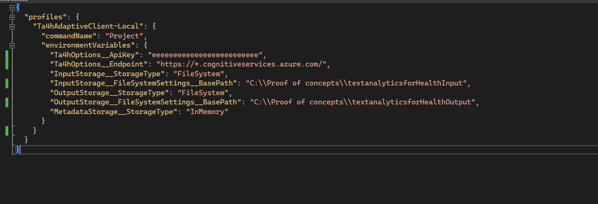
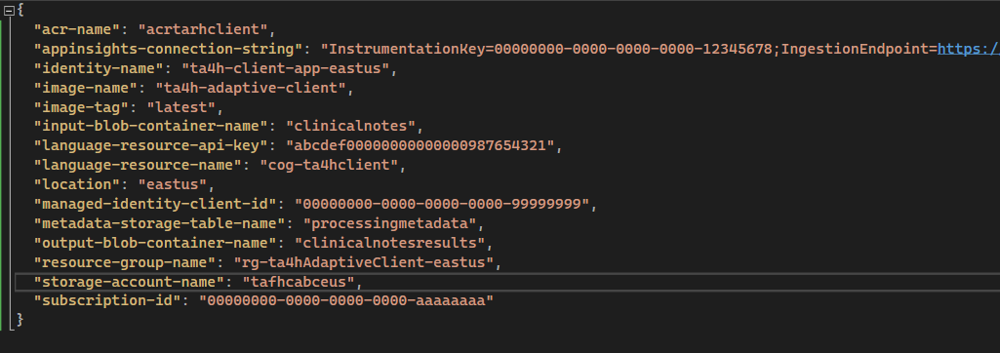

## Text Analytics for Health Adaptive Client for Processing Large Volumes of Data

This sample provides code and setup instructions for processing large volumes of medical data using Text Analytics for Health (TA4H). While the TextAnalytics SDKs offer a convenient way to call the TextAnalytics API and work with the analysis results programmatically, processing large volumes of data requires a solution optimized for efficiency and throughput. This sample is designed to minimize overall processing time for a large number of documents, considering server capacity and service limits (i.e., max allowed API calls per minute).

### Solution Architecture

The solution comprises several components:

-  **Input Storage**: Stores text documents. This could be a local file system storage, a mounted volume, an Azure blob storage, or any other implementation of the [IFileStorage](Services/Storage/DocumentStorage/IFileStorage.cs) interface. The default implementation assumes that every .txt file under the input storage location should be processed by TA4H.

-  **Output Storage**: Stores the results of TA4H analysis as JSON files. Like input storage, it can have different implementations.

-  **Metadata Storage**: Stores metadata about each document, such as its status (e.g., not started, processing, completed, etc.). This could be Azure table storage, a SQL database, or an in-memory implementation.

-  **Text Analytics for Health Endpoint**: Where the request will be sent. This could be the hosted API endpoint or an on-prem container.

-  **Client Application**: A dotnet 6 Console Application that reads documents from the Input storage, sends them for processing using the TA4H API, stores the results in the output storage and updates the metadata.

### Application Runtime Flow

1. Find all text files in the Input Storage.
2. Create an entry in the Metadata Storage for each document. (Note: The documents existing in the Input Storage at this point are the ones that will be processed. Documents added to the Input Storage after the application has started will not be processed.)
3. While there are still documents to be processed, perform the following steps:
    - Load a batch of text documents.
    - Group documents into "payloads" of multiple documents (the Text Analytics API can handle up to 25 documents in one request) to maximize throughput.
    - Send each payload to the Text Analytics for Health Endpoint for processing. (Note: the TA4H API is based on an asynchronous flow, so these calls return a job ID, which can be used to poll the API for job status and retrieve the analysis results when ready.)
4. On a separate thread, poll the API for the jobs that haven't been completed yet. When a job is done, store the results in the Output Storage and update the Metadata Storage with its status.
5. Continuously monitor pending jobs and average completion time to adapt the number of concurrent jobs. This adaptivity is crucial because it allows the server to utilize its maximum capacity without overload.
6. Once all documents are processed, and all jobs are completed, exit the app.

### Run as Local Console Application

You can run the application locally with no need to create any resources in Azure (except for the Language Resource itself). This is recommended for smaller datasets that you can process within a few hours or less.

**Requirements**: Dotnet 6 runtime, Visual Studio (optional)

To run as a local console application, follow these steps:

1. Clone the repository from GitHub: https://github.com/Microsoft/azure-health-ai-services-samples
2. Navigate to the `samples/ta4h-adaptive-client-blueprint` directory.
3. Create a `launchSettings.json` file under the 'Properties' directory and copy the "Ta4hAdaptiveClient-Local" profile definition from  [launchSettings-template.json](Properties/launchSettings-template.json). (If using VisualStudio, Make sure to set `Copy to Output Directory` to Copy Always/Copy if Newer )


4. Populate the missing values in `launchSettings.json`. These environment variables have to be set for the application to run successfully:
   - *Ta4hOptions__Endpoint* and *Ta4hOptions__ApiKey* : The API key and endpoint of your Azure language resource.  Note that if you are using Text Analytics for Health Container and not the hosted API, you need to specify the URL of the container/cluster you are running it on and not the language resource billing endpoint.
   - *InputStorage__FileSystemSettings__BasePath* and *OutputStorage__FileSystemSettings__BasePath* : Paths to local directories for input (text documents) and output (JSON results).
  Make sure you have added examples txt files under the directory specified in *InputStorage__FileSystemSettings__BasePath* . We have added some synthetic [test-data](./test-data/README.md) for you to use.

The launchSettings should look like this 


5. You can now build, run, and debug the application in Visual Studio.
6. Alternatively, you can run the application from the command line using:
 ```
dotnet run --launch-profile Ta4hAdaptiveClient-Local
```

### Run in Azure

Processing large volumes of data can take many hours or days. In such cases, it is recommended to have a resilient solution that can run on the cloud. The suggested solution comprises the following components:

- Docker: The Text Analytics for Health Adaptive Client dotnet application should be built into a Docker container image.
- Azure Container Instances (ACI): The container image will be run using ACI. ACI supports an "Always On" restart policy, which ensures that the container will be restarted if the application fails or stops for any reason. Running the application on Azure in the same region as the Language Resource and other Azure components minimizes network latency.
- Azure Language Resource: This is the account used to call the Text Analytics for Health API.
- Azure Blob Storage: Used to store the input documents (as text files) that should be sent to TA4H, and to store the analysis results returned from TA4H in JSON format.
- Azure Table Storage: Used to store the metadata of the documents and manage the workflow.
- Application Insights (optional): Can store the logs written from the application - helpful for investigating any issues and gathering statistics about errors and latency.

### Run in Azure - Step by Step Instructions

The following instructions describe how to deploy this solution on Azure using the Azure CLI. As you go through the steps, copy the values for the parameters that appear in \<angle brackets> and write them in [deployment-params.json](Deployment/deployment-params.json). You will need these in the next steps. (You can also perform most of these steps directly through the Azure portal.)

###### 1. Prerequisites

- Set the Azure subscription you are going to create all the resources in (if you have more than one)
```
az account set --subscription <subscription-id>
```
- Create a Resource Group to contain the Azure resources that will be used to deploy this solution:
```
az group create --name <resource-group-name> --location <location>
```
- Populate the values for *subscription-id*, *resource-group-name* and *location* in  [deployment-params.json](Deployment/deployment-params.json).

- Create the Language Resource. (Note: if you already have a language resource **in the same Azure region**, you can skip this step and just use the API key of the existing resource.)
```
az cognitiveservices account create --name <language-resource-name> --resource-group <resource-group-name> --kind TextAnalytics --sku S --location <location> --yes
```
- Get the language resource apiKey and populate the values for *language-resource-api-key* and *language-resource-name* in [deployment-params.json](Deployment/deployment-params.json)


###### 2. Setup Azure Storage

Azure storage will be used to store the input documents, the TA4H results and the metadata. In this sample we use the same storage account for all of these purposes, but you cna choose to do differently.

- Create an Azure Storage account:
```
az storage account create --name <storage-account-name> --resource-group <resource-group-name> --sku Standard_LRS
```

- Under the storage account, create the input blob container that will store the documents:
```
az storage container create --name <input-blob-container-name> --account-name <storage-account-name> --auth-mode login
```

- Create the output container:
```
az storage container create --name <output-blob-container-name> --account-name <storage-account-name> --auth-mode login
```

- Under the same storage account, create the output blob container that will store the results:
```
az storage container create --name <output-blob-container-name> --account-name <storage-account-name> --auth-mode login
```
this step is not mandatory as the application can create the blob container in runtime if it does not exist.

- Populate the values of *storage-account-name*, *input-blob-container-name* and *output-blob-container-name* in [deployment-params.json](Deployment/deployment-params.json).

- Choose a name for *metadata-storage-table-name* and populate in in [deployment-params.json](Deployment/deployment-params.json). *Note*: once the table is initialized, the documents for processing are already set. if you run the application multiple times on different input documents, you would need to clear the table, or just supply a different table name each time.

###### 3. Create a Container Registry

- Create an Azure Container Registry (ACR) to host the application Docker image:
```
az acr create --resource-group <resource-group-name> --name <acr-name> --sku Basic
```

- Populate the value of *acr-name* in [deployment-params.json](Deployment/deployment-params.json).


###### 4. Setup Managed Identity and Role Assignments

- Create a Managed Identity. This will be assigned to the Azure Container Instance running the application, allowing the application to authenticate to other Azure resources without the need for passwords or connection strings.
```
az identity create --name <identity-name> --resource-group <resource-group-name>
```
- Retrieve the client ID of the managed identity just created:
```
 az identity show --name <identity-name> --resource-group <resource-group-name>  --query "clientId"
```

- Populate the values for *identity-name* and *managed-identity-client-id* in [deployment-params.json](Deployment/deployment-params.json).

- Add role assignments for blob read/write access and table read/write access to the managed identity:
```
az role assignment create --role "Storage Blob Data Contributor" --assignee <managed-identity-client-id> --scope /subscriptions/<subscription-id>/resourceGroups/<resource-group-name>/providers/Microsoft.Storage/storageAccounts/<storage-account-name>
az role assignment create --role "Storage Table Data Contributor" --assignee <managed-identity-client-id> --scope /subscriptions/<subscription-id>/resourceGroups/<resource-group-name>/providers/Microsoft.Storage/storageAccounts/<storage-account-name>
```

- If you plan to run the application locally with Azure Storage or loading input data into in programmatically, add the same role assignment to your personal AAD identity:
```
az role assignment create --role "Storage Blob Data Contributor" --assignee <your-azure-identity-email> --scope /subscriptions/<subscription-id>/resourceGroups/<resource-group-name>/providers/Microsoft.Storage/storageAccounts/<storage-account-name>
az role assignment create --role "Storage Table Data Contributor" --assignee <your-azure-identity-email> --scope /subscriptions/<subscription-id>/resourceGroups/<resource-group-name>/providers/Microsoft.Storage/storageAccounts/<storage-account-name>
```

- Add read permissions to the managed identity to pull from the ACR, enabling the Azure Container Instance to pull the image without using user-password login:
```
az role assignment create --role "AcrPull" --assignee <managed-identity-client-id> --scope /subscriptions/<subscription-id>/resourceGroups/<resource-group-name>/providers/Microsoft.ContainerRegistry/registries/<acr-name>
```


###### 5. Populate the Input Storage

- Load the txt documents that you would like to process from a local directory into Azure Storage.
```
az storage blob upload-batch --destination <input-blob-container-name> --source <input-txt-files-local-dir> --account-name <storage-account-name> --auth-mode login
```

**Note**: if your documents are already stored in an existing azure blob storage, you can skip this step. However, in that case you would need to set up the role assignments to your existing azure storage account, and set the value of InputStorage__AzureBlobSettings__ConnectionString in [aci_template.yaml](Deployment/aci_template.yaml) accordingly. 
 If you don't already have your data in Azure storage and would like to migrate it, you can read about it [here](https://learn.microsoft.com/en-us/azure/storage/common/storage-migration-overview).
 Anyway, it is recommended to start with a relatively small dataset of a few hundreds to few thousand documents to test your solution.

###### 6. Add Application Insights (Recommended)

- Create a log analytics workspace and Application Insights to store the application telemetry:

``` 
az monitor log-analytics workspace create --resource-group <resource-group-name> --workspace-name <workspace-name> 
az extension add -n application-insights
az monitor app-insights component create --app ta4hAdaptiveClient --location <location> --kind web --resource-group <resource-group-name>  --workspace "/subscriptions/<subscription-id>/resourceGroups/<resource-group-name>/providers/microsoft.operationalinsights/workspaces/<workspace-name>"
``` 

- Retrieve the Application Insights Connection String
```
az monitor app-insights component show --app ta4hAdaptiveClient --resource-group <resource-group-name> --query "connectionString"
```

- Populate the value of *appinsights-connection-string* in [deployment-params.json](Deployment/deployment-params.json):

- Now all values in [deployment-params.json](Deployment/deployment-params.json) should be populated. It should look something like this:



- Note: if you choose not to use application insights you need to not set the ApplicationInsights__ConnectionString environment variable when running the application.


###### 7. Run locally with Azure Resources (Optional)

This step is not necessary. You can use it to validate that the azure storage resources were correctly set and to debug if needed.

- copy the "Ta4hAdaptiveClient-Azure" profile definition from  [launchSettings-template.json](Properties/launchSettings-template.json) to [launchSettings.json](Properties/launchSettings.json).
- Find and replace all the parts in \<angle brackets\> with the values you stored in [deployment-params.json](Deployment/deployment-params.json) You can do this manually or automatically by running the utility Python script [populate_with_parameters.py](Deployment/deployment-params.json):
```
python -m populate_with_parameters --template-file ./Properties/launchSettings-template.json --profile Ta4hAdaptiveClient-Azure
```
- Run the application in Visual Studio

###### 8. Build and Push Docker Image

- Choose names for image name and tag and Build the application using the Dockerfile. Navigate to the root directory of this project and run:
```
docker build . --platform=linux/amd64 -t <acr-name>.azurecr.io/<image-name>:<image-tag> 
```

- Populate the values for *image-name* and **image-tag* in [deployment-params.json](Deployment/deployment-params.json). 

- Login to the ACR:
```
az acr login --name <acr-name>
```

- Push the image you built to the ACR:
```
docker push <acr-name>.azurecr.io/<image-name>:<image-tag>
```

###### 9. Create and Run Azure Container Instance (ACI)

- Under the /Deployment folder, copy the [aci_template.yaml](Deployment/aci_template.yaml) file into a new file called aci_deployment.yaml.
- Fill in all the required parameters that from previous steps in the deployment-params.json file. You can find this under Deployments.
The metadata-storage-table-name name is needed to auto generate the Azure Table Storage. 

- Find and replace all the parts in \<angle brackets\> with the values you stored in [deployment-params.json](Deployment/deployment-params.json) You can do this manually or automatically by running the utility Python script [populate_with_parameters.py](Deployment/deployment-params.json):
```
python -m populate_with_parameters --template-file aci_template.yaml
```

- Validate that all parameterized parts of the aci_template.yaml are populated correctly. Then, create the Azure Container Instance to run the application. 
```
az container create --resource-group <resource-group-name> --file aci_deployment.yaml
```

- This may take a minute to complete. If the ACI creation and running was successful, you will see in the command output that the instance status is 'Running'.

###### 10. Validate the deployment

- In Azure portal, go to the Azure Container Instance you've just created and under "Settings" go to "Containers". You can go to the "logs" tab to see the logs written from the container.
- If you created Application Insights, you can go to it in Azure portal and find the application logs under Monitoring -> Logs. you can query the traces and dependencies tables. Note that there is a few minutes delay when logs are written to application insights.
- Go to the Azure Storage resource you created in Azure portal. Open the Storage browser. You can see the status of your documents in the metadata table under 'Tables' and the TA4H results in your output storage under 'Blob containers'.


###### 11. Run with a large dataset

After you've tested the solution, you can now set things up to run on your large dataset of .txt files.
The are a few important notes to remember:

- Make sure all the documents you want to run are in the same blob container in Azure storage and that the application is able to read from it. You should not add documents to this blob container after you started running the app.
- Once the metadata storage is initialized, it will not be changed. So if you change the input storage you should also change the metadata table name before you run/deploy the app.
- The aci_deployment.yaml file sets restartPolicy to "Never". This means that once the application quitted (whether because it finished processing the data or because of an error) the container instance stops and does not restart. If you are running a large dataset that may take days to complete, you should change the restart policy to "Always", so if the container crashes due to some error or transient issue, it will restart, and continue to process the documents.
- It is **not** recommended to create multiple container instances to "split" the work between them to speed up the processing. A single container instance, if run in the same Azure Region as the Text Analytics endpoint and Azure Storage, should be enough to maximize the throughput given the service limits of your Text Analytics resource. Running multiple instance may result in repeated processing of the same documents.

