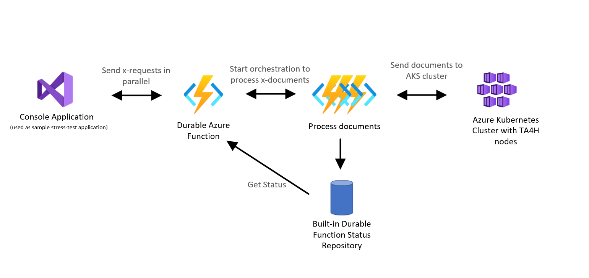
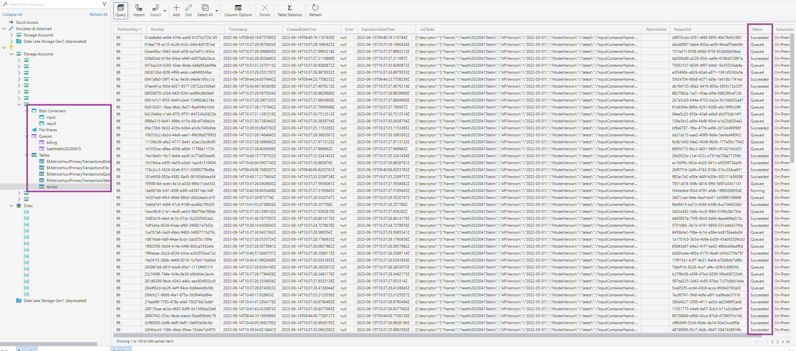
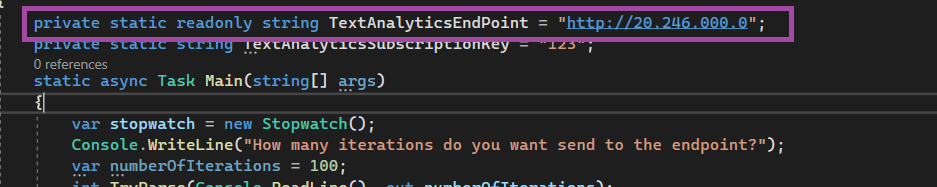
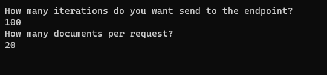
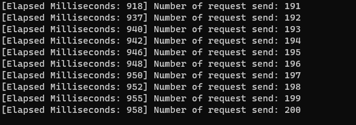

# Text Analytics for Health Container Batch Usage

This samples uses a [.Net Core Console Application](/samples/ta4h-container-e2e-sample/StressTestConsoleClient/) that sends documents to the Azure Kubernetes Cluster. The .Net Core Console application sends all the documents, in an async way to the cluster. The Text Analytics for Health containers  will process the documents in an asynchronous way. If all the containers are seeded, all new documents will be added to the Text Analytics for Health Queue.

The high level client architecture can be seen below:

When the Text Analytics for Health containers start to receive documents, the containers will put all the documents on on the `input` container. All the processed documents will be found in the `result` container. All documents from the `input` and `result` container can be corelated by an unique generated identifier.

When all containers are busy processing documents, all new documents will be put on the queue and picked up by a container, as soon as its done processing the previous document. 

All the information of the jobs can be found in the `taJobs` Table in Azure Table Storage. The Status field shows the status of the document (`Queued, Processing, Succeeded, Failed`)

An example of the `taJobs` can be seen below

## Start using the sample

The .NET Core Console application will interact with the Azure Kubernetes Cluster. You will need to change the `TextAnalyticsEndpoint` varaible with the public IP of your Azure Kubernetes Cluster.

The Client Application uses the Text Analytics for Health Endpoint, which can send one or more documents to the cluster. For every request you can send up to 25 documents, with a max of 125 000 characters in total.
The Client application contains several synthetic patient documents that you can use to test the endpoint. 

When starting the [.Net Core Console Application](/samples/ta4h-container-e2e-sample/StressTestConsoleClient/) you will need to provide the number of requests and documents you want to send to the cluster.

When all documents have been send, you can track the proccess in the Azure Table Storage (`taJobs`)

