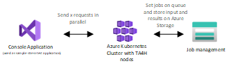
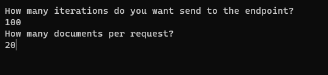

# Text Analytics for Health Container Async Batch Usage

This samples uses a [.Net Core Console Application](/samples/text-analytics-for-health-async/StressTestConsoleClient/) and Azure Functions to recieve and propogate messages to the Azure Kubernetes Cluster. 
This enables scaling and status follow-up. To enable background jobs we are using Durable Functions, more specifically we are using the Async HTTP API pattern.

With this setup you can use the scalability of Azure functions to automatically scale out based on incoming requests. You can read more on Azure Functions scaling [here](https://learn.microsoft.com/en-us/azure/azure-functions/functions-scale). 


The client setup architecture can be found below:



## Start using the sample

To start interacting with the cluster you need to send on or more HTTP POST requests to your Azure Function. For every request you can send up to 25 documents, with a max of 125 000 characters in total, to the Azure Function.
The console application contains several generated patient documents that you can use to test the endpoints. 

When starting the [.Net Core Console Application](/samples/text-analytics-for-health-async/StressTestConsoleClient/) you will need to provide the number of requests and documents you want to send to the cluster.



The client .Net Core application also starts polling the Function to validate if the job succeeded or failed. 

All processed documents will be automatically stored on the storage account you provided when setting up the client application. For every document send to the Function, there will be a dedidcated JSON file with the original document and the results. All results are stored in a container named `healthcareentitiesresults`, the naming convention of the file is the current DateTime followed with an underscore and the `id` of the document 


## JSON result structure
Every file on your Azure Storage Accountshould contain the following structure

```JSON
{
    "id": "1",
    "text": "The patient is taking Metformin 500mg daily for diabetes",
    "healthcareEntitiesResult": [
        {
            "Text": "Metformin",
            "Category": {},
            "SubCategory": null,
            "ConfidenceScore": 1.0,
            "Offset": 22,
            "Length": 9,
            "DataSources": [
                {
                    "EntityId": "C0025598",
                    "Name": "UMLS"
                },
                {
                    "EntityId": "A10BA02",
                    "Name": "ATC"
                },
                {
                    "EntityId": "0000008019",
                    "Name": "CHV"
                },
                {
                    "EntityId": "4007-0083",
                    "Name": "CSP"
                },
                {
                    "EntityId": "DB00331",
                    "Name": "DRUGBANK"
                },
                {
                    "EntityId": "4442",
                    "Name": "GS"
                },
                {
                    "EntityId": "sh2007006278",
                    "Name": "LCH_NW"
                },
                {
                    "EntityId": "LP33332-5",
                    "Name": "LNC"
                },
                {
                    "EntityId": "d03807",
                    "Name": "MMSL"
                },
                {
                    "EntityId": "D008687",
                    "Name": "MSH"
                },
                {
                    "EntityId": "9100L32L2N",
                    "Name": "MTHSPL"
                },
                {
                    "EntityId": "C61612",
                    "Name": "NCI"
                },
                {
                    "EntityId": "004534",
                    "Name": "NDDF"
                },
                {
                    "EntityId": "x01Li",
                    "Name": "RCD"
                },
                {
                    "EntityId": "6809",
                    "Name": "RXNORM"
                },
                {
                    "EntityId": "372567009",
                    "Name": "SNOMEDCT_US"
                },
                {
                    "EntityId": "4023979",
                    "Name": "VANDF"
                }
            ],
            "Assertion": null,
            "NormalizedText": "metformin"
        },
        {
            "Text": "500mg",
            "Category": {},
            "SubCategory": null,
            "ConfidenceScore": 1.0,
            "Offset": 32,
            "Length": 5,
            "DataSources": [],
            "Assertion": null,
            "NormalizedText": null
        },
        {
            "Text": "daily",
            "Category": {},
            "SubCategory": null,
            "ConfidenceScore": 1.0,
            "Offset": 38,
            "Length": 5,
            "DataSources": [],
            "Assertion": null,
            "NormalizedText": null
        },
        {
            "Text": "diabetes",
            "Category": {},
            "SubCategory": null,
            "ConfidenceScore": 1.0,
            "Offset": 48,
            "Length": 8,
            "DataSources": [
                {
                    "EntityId": "C0011849",
                    "Name": "UMLS"
                },
                {
                    "EntityId": "DIABT",
                    "Name": "AIR"
                },
                {
                    "EntityId": "0000005999",
                    "Name": "AOD"
                },
                {
                    "EntityId": "BI00008",
                    "Name": "BI"
                },
                {
                    "EntityId": "1018264",
                    "Name": "CCPSS"
                },
                {
                    "EntityId": "0000003834",
                    "Name": "CHV"
                },
                {
                    "EntityId": "230",
                    "Name": "COSTAR"
                },
                {
                    "EntityId": "0862-6160",
                    "Name": "CSP"
                },
                {
                    "EntityId": "DIABETES MELL",
                    "Name": "CST"
                },
                {
                    "EntityId": "U000960",
                    "Name": "DXP"
                },
                {
                    "EntityId": "HP:0000819",
                    "Name": "HPO"
                },
                {
                    "EntityId": "E10-E14.9",
                    "Name": "ICD10"
                },
                {
                    "EntityId": "E10-E14.9",
                    "Name": "ICD10AM"
                },
                {
                    "EntityId": "E08-E13",
                    "Name": "ICD10CM"
                },
                {
                    "EntityId": "250",
                    "Name": "ICD9CM"
                },
                {
                    "EntityId": "T90",
                    "Name": "ICPC"
                },
                {
                    "EntityId": "T90002",
                    "Name": "ICPC2P"
                },
                {
                    "EntityId": "MTHU020781",
                    "Name": "LNC"
                },
                {
                    "EntityId": "10012601",
                    "Name": "MDR"
                },
                {
                    "EntityId": "30479",
                    "Name": "MEDCIN"
                },
                {
                    "EntityId": "4",
                    "Name": "MEDLINEPLUS"
                },
                {
                    "EntityId": "D003920",
                    "Name": "MSH"
                },
                {
                    "EntityId": "U000263",
                    "Name": "MTH"
                },
                {
                    "EntityId": "250.0",
                    "Name": "MTHICD9"
                },
                {
                    "EntityId": "00385",
                    "Name": "NANDA-I"
                },
                {
                    "EntityId": "C2985",
                    "Name": "NCI"
                },
                {
                    "EntityId": "MTHU036798",
                    "Name": "OMIM"
                },
                {
                    "EntityId": "CDR0000685852",
                    "Name": "PDQ"
                },
                {
                    "EntityId": "13970",
                    "Name": "PSY"
                },
                {
                    "EntityId": "R0121582",
                    "Name": "QMR"
                },
                {
                    "EntityId": "C10..",
                    "Name": "RCD"
                },
                {
                    "EntityId": "D-2381",
                    "Name": "SNM"
                },
                {
                    "EntityId": "DB-61000",
                    "Name": "SNMI"
                },
                {
                    "EntityId": "73211009",
                    "Name": "SNOMEDCT_US"
                },
                {
                    "EntityId": "0371",
                    "Name": "WHO"
                }
            ],
            "Assertion": null,
            "NormalizedText": "Diabetes Mellitus"
        }
    ]
}
``` 